# Rhythmix - 10 Chuc Nang Va So Do Pipeline

Tai lieu nay doi chieu 10 chuc nang bat buoc trong `Database/input.md` voi cac thanh phan dang co trong project Rhythmix. Du an su dung React + TypeScript o frontend, ASP.NET Core Web API, MediatR, Dapper va SQL Server o backend.

## 1. Danh sach 10 chuc nang

| # | Chuc nang theo de bai | Hien thuc trong Rhythmix | API / Use case tieu bieu | Man hinh React |
|---|---|---|---|---|
| 1 | Xac thuc | Dang ky, dang nhap, dang xuat, OTP dang ky, JWT | `AuthController`, `RegisterCommand`, `LoginQuery`, `LogoutCommand` | `AuthModal` |
| 2 | Ho so nguoi dung | Xem/sua profile, avatar, bio | `ProfileController`, `UpdateProfileCommand` | `ProfilePage` |
| 3 | Thu vien media | Upload audio/video, metadata, anh bia, xoa audio cua chu so huu | `MediaController`, `UploadMediaCommand`, `DeleteMediaCommand` | `LibraryPage`, `UploadMediaModal` |
| 4 | Audio player | Stream audio, play/pause/seek, queue, lich su nghe | `GET /api/media/{id}/stream`, `RecordPlayHistoryCommand` | `PlayerBar`, `QueueSidebar` |
| 5 | Video player | Stream video, poster, modal phat video, seek va volume dung chung player | `GET /api/media/{id}/stream?type=video` | `VideoPlayerModal` |
| 6 | Playlist | CRUD playlist, them/xoa track, sap xep, public/private | `PlaylistsController`, `CreatePlaylistCommand`, `AddTrackToPlaylistCommand` | `PlaylistDetailPage`, `CreatePlaylistModal` |
| 7 | Tim kiem va kham pha | Tim media, artist, album, playlist; playlist theo the loai; AI recommendation | `SearchController`, `SearchQuery`, `AIController` | `SearchPage`, `HomePage` |
| 8 | Chia se media | Chia se song/video/playlist, inbox va outbox | `SharesController`, `CreateShareCommand` | `ShareModal`, `ShareInboxPage` |
| 9 | Thong bao | Luu notification, danh sach, danh dau da doc, SignalR real-time | `NotificationsController`, `INotificationHub` | `NotificationsPage`, `NotificationContext` |
| 10 | Tuong tac va lich su | Like/favorite va lich su nghe gan day | `InteractionsController`, `ToggleFavoriteCommand`, `RecordPlayHistoryCommand` | `LikedSongsPage`, `PlayerBar` |

## 2. Pipeline chung

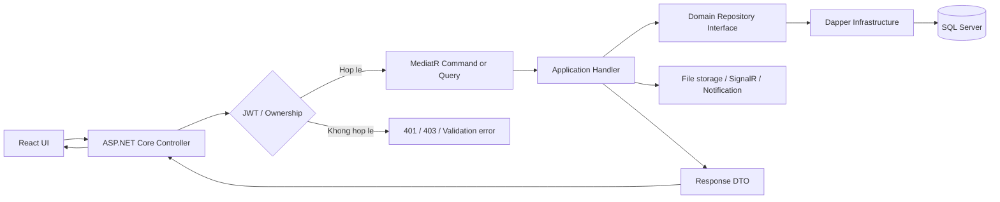

Pipeline ap dung cho moi use case: validation request, xac thuc/kiem tra quyen, handler xu ly nghiep vu, repository Dapper truy van SQL, side effect neu can, sau do map ve DTO.

## 3. Pipeline chi tiet - Auth

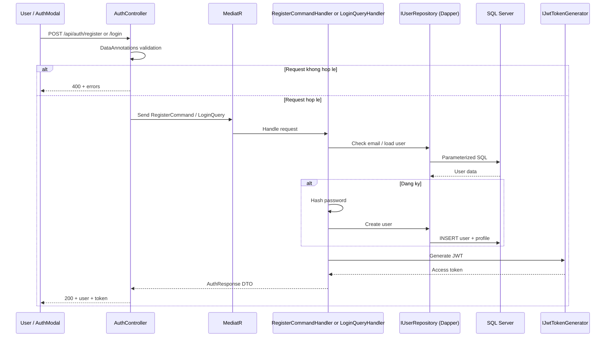

## 4. Pipeline chi tiet - Upload va Streaming Media

```mermaid
flowchart TD
    U[LibraryPage / UploadMediaModal] --> C[POST /api/media/upload]
    C --> V{Validate JWT, file size, extension, MIME}
    V -->|Invalid| E[400 Validation error]
    V -->|Valid| CMD[UploadMediaCommand]
    CMD --> H[UploadMediaCommandHandler]
    H --> FS[IFileStorageService]
    FS --> DISK[wwwroot/uploads]
    H --> ART[Find or create Artist]
    H --> REP[IMediaRepository]
    REP --> SQL[(MediaItems, MediaItemGenres)]
    SQL --> DTO[MediaDto]
    DTO --> UI[Library refresh]

    P[PlayerBar / VideoPlayerModal] --> S[GET /api/media/{id}/stream]
    S --> AUTH[Authorize]
    AUTH --> FILE[Read stored media file]
    FILE --> HTML5[HTML5 audio or video player]
```

## 5. Pipeline chi tiet - Share Media va Notification

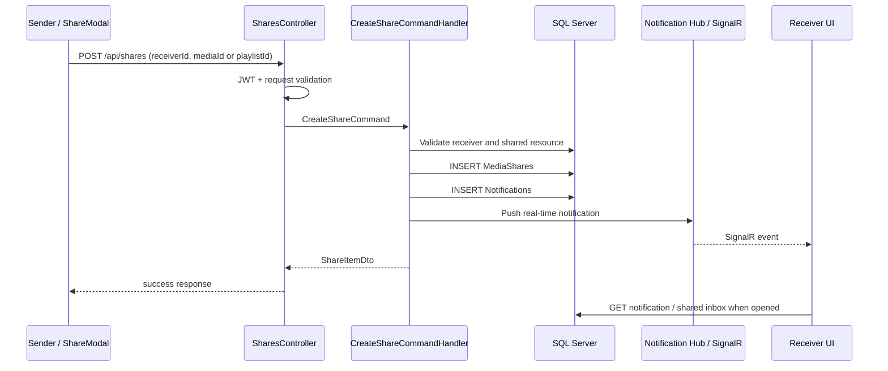

## 6. Pipeline chuc nang 1 - Xac thuc

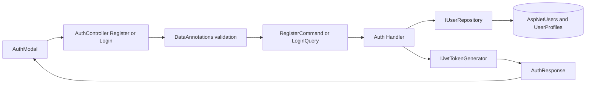

## 7. Pipeline chuc nang 2 - Ho so nguoi dung

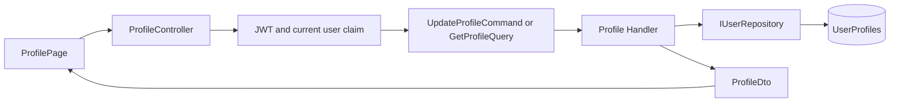

## 8. Pipeline chuc nang 3 - Thu vien media

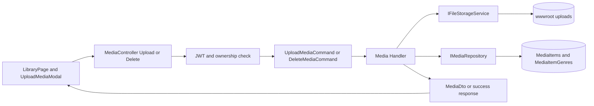

## 9. Pipeline chuc nang 4 - Audio player

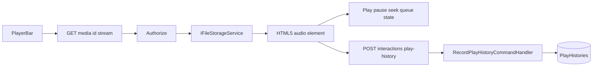

## 10. Pipeline chuc nang 5 - Video player

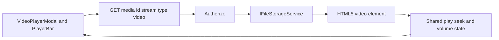

## 11. Pipeline chuc nang 6 - Playlist

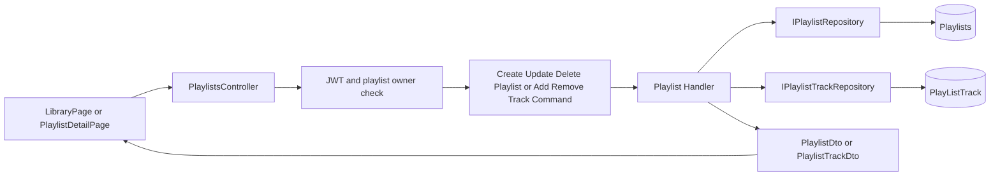

## 12. Pipeline chuc nang 7 - Tim kiem va kham pha

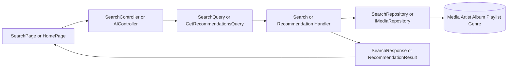

## 13. Pipeline chuc nang 8 - Chia se media

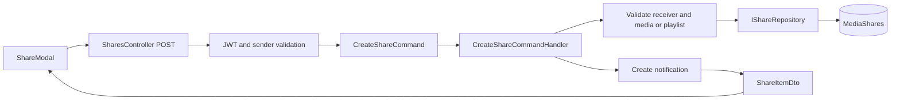

## 14. Pipeline chuc nang 9 - Thong bao

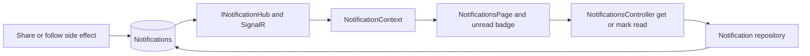

## 15. Pipeline chuc nang 10 - Tuong tac va lich su

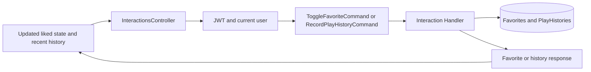

## 16. Luu y khi dua vao bao cao

- Du an chon Dapper, do do cac handler chi phu thuoc repository interface; SQL nam trong `Rhythmix.Infrastructure/Dapper`.
- Controller chi nhan request, lay JWT claim va goi MediatR; logic nghiep vu nam trong Application handler.
- Chuc nang 8 va 9 lien ket voi nhau: share thanh cong tao record chia se, luu notification va push SignalR.
- AI Recommendation la chuc nang bo sung: `AIController` goi query recommendation, doc history/favorite/catalog, sau do tra lai media ton tai trong CSDL.
